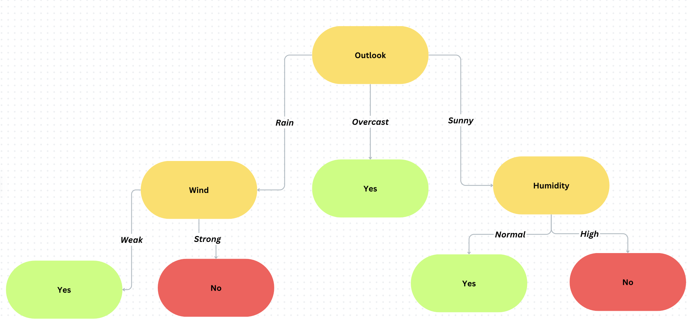

This repo is my implementation after reading the ID3 paper proposed in 1986 by J.R. Quinlan found [here](https://link.springer.com/article/10.1007/BF00116251).

Also more info about my thoughts can be found on my blog [here](https://himati.bearblog.dev/paper-reviews-induction-of-decision-trees-1986-quinlan/).

Data used can be found [here](https://www.kaggle.com/datasets/sameerhimati/id3-dataset).

The Decision Trees based on the algorithm are found here for the [clean](cleanTree.txt) and [noisy](noisyTree.txt) datasets. 

